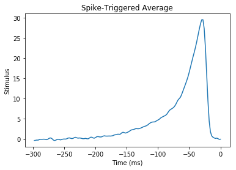

# Spike Triggered Average in TensorFlow

The data is an experimentally recorded set of spikes recorded from the famous H1 motion-sensitive neuron of the fly (Calliphora vicina) from the lab of Dr Robert de Ruyter van Steveninck.

This is a complete rewrite of non-tensorflow code in the Coursera course [Computational Neuroscience](https://www.coursera.org/learn/computational-neuroscience/home/welcome) by University of Washington.  I am thoroughly enjoying this course!

Here we use TensorFlow to find out how the neuron is reacting to the data, to see what causes the neuron to trigger.


```python
%matplotlib inline
import pickle
import matplotlib.pyplot as plt
import numpy as np
import tensorflow as tf
sess = tf.InteractiveSession()

FILENAME = 'data.pickle'

with open(FILENAME, 'rb') as f:
    data = pickle.load(f)

stim = tf.constant(data['stim'])
rho = tf.constant(data['rho'])
sampling_period = 2 # The data was sampled at 500hz = 2ms
window_size = 150 # Let's use a 300ms / sampling_period sliding window
```

We now have our data loaded into tensorflow as a constant, which means that we can easily 'run' our tensorflow graph.  For example, let's examine stim and rho:


```python
print("Spike-train time-series =", rho.eval(), "\nStimulus time-series    =", stim.eval())
```

    Spike-train time-series = [0 0 0 ..., 0 0 0] 
    Stimulus time-series    = [-111.94824219  -81.80664062   10.21972656 ...,    9.78515625   24.11132812
       50.25390625]


rho is an binary array where a 1 indicates a spike.  Let's turn that into an array of indices of where the value is 1, but ignoring the first window_size elements.

**Note:** We can use the [] and + operations on a tensorflow variable, and it correctly adds those operations to the graph.  This is equivalent to using  the tf.slice and tf.add operations.


```python
spike_times = tf.where(tf.not_equal(rho[window_size:-1], 0)) + window_size
print("Time indices where there is a spike:\n", spike_times.eval())
```

    Time indices where there is a spike:
     [[   158]
     [   160]
     [   162]
     ..., 
     [599936]
     [599941]
     [599947]]


```python
def getStimWindow(index):
    i = tf.cast(index, tf.int32)
    return stim[i-window_size+1:i+1]
stim_windows = tf.map_fn(lambda x: getStimWindow(x[0]), spike_times, dtype=tf.float64)
spike_triggered_average = tf.reduce_mean(stim_windows, 0).eval()
print("Spike triggered averaged is:", spike_triggered_average[0:5], "(truncated)")
```

    Spike triggered averaged is: [-0.33083048 -0.29083503 -0.23076012 -0.24636984 -0.10962767] (truncated)


Now let's plot this!


```python
time = (np.arange(-window_size, 0) + 1) * sampling_period
plt.plot(time, spike_triggered_average)
plt.xlabel('Time (ms)')
plt.ylabel('Stimulus')
plt.title('Spike-Triggered Average')

plt.show()
```





It's...  **beautiful**!

What we are looking at here, is that we've discovered that our neuron is doing a [leaky integration](https://en.wikipedia.org/wiki/Leaky_integrator) of the stimulus.  And when that integration adds up to a certain value, it triggers.
